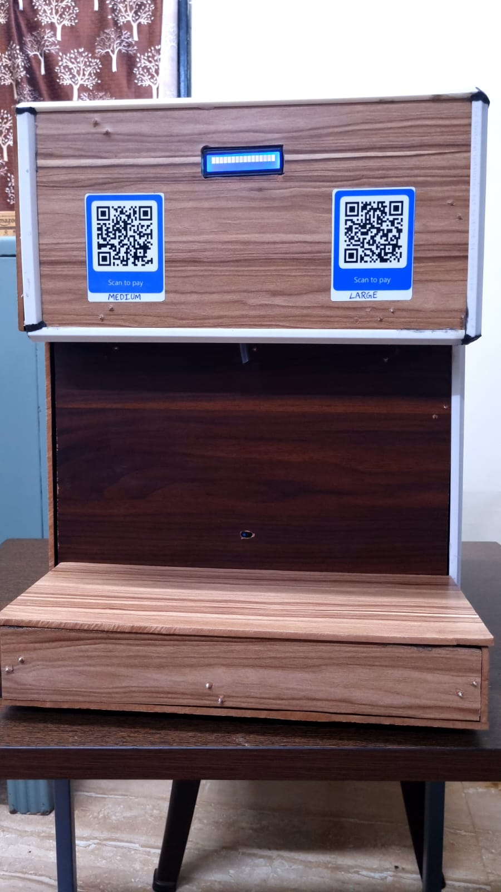
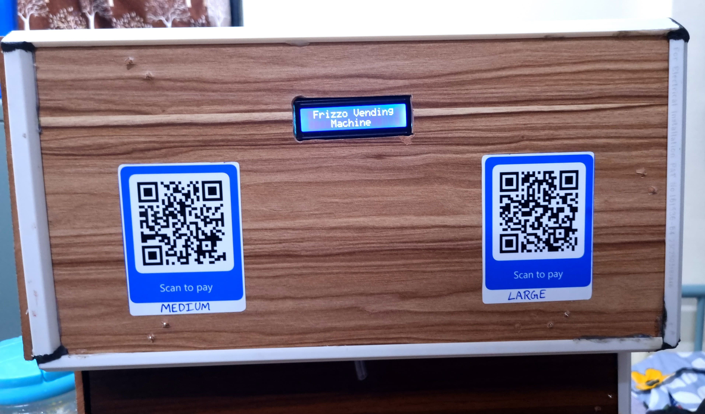
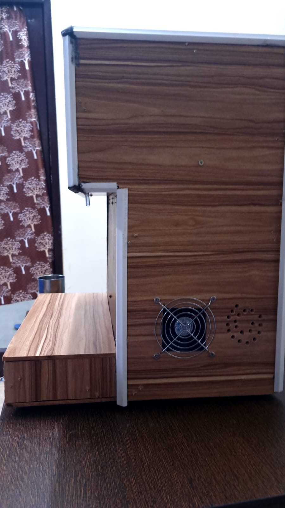

# 🥤 Automated Vending Machine

An innovative project that combines embedded systems, payment integration, and real-time control — our Automated Vending Machine delivers chilled drinks via a Raspberry Pi core and Stripe-powered QR code payments.

---

## 🚀 Project Overview

Our team collaboratively developed an **Automated Vending Machine** that:

- Uses a **Raspberry Pi** as the central control unit.
- Integrates **Stripe** for secure online payments via QR codes.
- Features **Peltier modules** to deliver chilled beverages.
- Leverages **Stripe Webhooks** for real-time payment validation.
- Showcases a seamless blend of hardware and software systems.

---

## 💡 Key Features

- 🧊 **Chilled Drink Dispensing** using Peltier cooling technology.
- 💳 **QR Code-Based Payments** using Stripe Checkout.
- 🔄 **Real-Time Payment Validation** via Stripe Webhooks.
- 🖥️ **Raspberry Pi Control Interface** managing hardware operations.
- 🔒 Secure and scalable design ideal for real-world deployment.

---

## 🧠 Tech Stack

- **Hardware**: Raspberry Pi, Peltier Modules, Relays, Power Supply, Sensors.
- **Software**: Python, Flask (for webhook server), Bash (system scripts).
- **Payment Gateway**: Stripe Checkout & Webhooks.
- **Other Tools**: QR Code Generation, Local Network APIs.

---

## 🌟 Why It Matters

This project bridges the gap between hardware and software, offering real-world experience in:

- Embedded systems design
- API integration
- Team-based product development
- Full-stack IoT system architecture

It holds tremendous potential as a **market-ready solution** for smart vending applications in campuses, offices, and public spaces.

---

## 👥 Team & Acknowledgments

This project was a joint effort between students from:

- **Electrical and Computer Engineering (ECE)**
- **Computer Science and Engineering (CSE)**

---

## 📸 Screenshots

Here are some highlights from our vending machine in action:

### 🧊 Front View and Internal Setup
 

### 💳 QR Code Display and Payment System
  

---

## 🎥 Demo Video

Watch the full demo on YouTube:

---

## 📦 Future Enhancements

- Mobile app integration for order tracking
- Inventory management dashboard
- Thermal receipt printing
- Cloud data logging for analytics

---

## 📬 Contact

For questions or collaboration ideas, feel free to open an issue or contact us.

---

